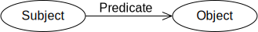
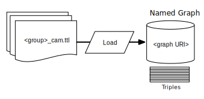
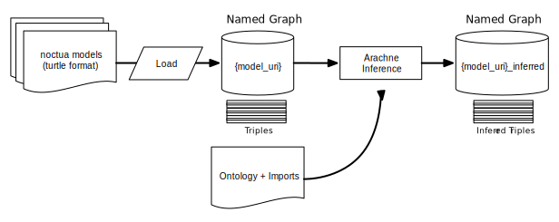
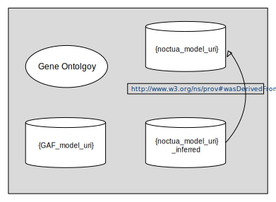
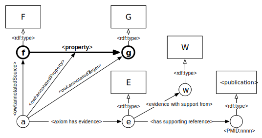

# Gene Ontology Public Triple Store

The Gene Ontology hosts an RDF triple store that contains
[GO-CAM][1] data. This lives at http://rdf.geneontology.org. To access the
 SPARQL endpoint (say using some SPARQL query web interface), use
  http://rdf.geneontology.org/blazegraph/sparql This will outline what all is
  contained in more detailed in this store, the data models used, and how to
  query the store.

The database is a [Blazegraph](https://www.blazegraph.com/) triple store.

## Triple Store Contents

The triple store contains data from GAFs from the model organism databases, and
contains Production Noctua models. Additionally, it has the full Ontology.

### The Pipeline

The Blazegraph triple store gets produced as one of the steps of the pipeline.
After the GAF annotations have been validated by [Ontobio](https://github.com/biolink/ontobio)
the validated GAFs are loosely converted into GO-CAMs. There is roughly
one "Annoton" per GAF annotation line. Once we have RDF GO-CAMs of the GAFs,
they are imported into the triple store. The specifics of how the this is
organized in the triple store is discussed below.

### Contents

The Ontology and all imports, all GAFs as GO-CAMs, and all production Noctua
GO-CAM models live in the triple store. Additionally, the [Arachne](https://github.com/balhoff/arachne)
reasoner is run on all Noctua GO-CAM models, producing a set of inferred data.

## Data Model

The data in the triple store is RDF, or the [Resource Descriptor Framework](https://www.w3.org/TR/rdf11-concepts/).

### RDF

RDF is a simple data model that more interesting modeling systems can be mapped
onto, such as OWL. The Gene Ontology is expressed in OWL, but when loaded into
the triple store, it must be serialized as RDF. All semantics expressed in OWL
are maintained in RDF, it is just a different data format.

RDF data is organized as **Triples**: a *Subject*, a *Predicate*, and an *Object*:

The Subject and Object are called **Nodes**, and they are connected by a Predicate.
Nodes and Predicates are usually named, and they are named with a *URI*, like in
OWL. There are also unnamed nodes, so-called **Blank** nodes. These are used as a
part of the OWL serialization and must be taken care when writing queries as they do
not have a URI. There are also **Literals**, which represent raw values, such as
a string (text) or a number, etc.

Parts of the triple can only be certain types.

- *Subject*: **URI**, or **Blank**.

- *Predicate*: **URI**

- *Object*: **URI**, **Blank**, or **Literal**

### Graphs

In the Blazegraph triple store, Triples can exist either in the store just as
themselves, or inside a **Graph**. Graphs are containers for Triples, and have
a URI. In this way a Triple can become a "Quad": Subject, Predicate, Object, Graph.
This is important because when querying with SPARQL (the query language used for
triple stores), it is possible to query for only Triples in a specific graph.
Triples without a graph are said to be in the **Default Graph**.

In the Gene Ontology triple store, the RDF triples (in the ttl format) from a GAF file
 get placed in their own graph.

Additionally, each Noctua model
gets placed into its own graph. And lastly each set of inferred triples from
Noctua models gets placed in its own graph.

During the reasoning process a triple linking the inferred graph to the asserted
graph is written in the inferred graph. This looks like:

    <foo_inferred> <http://www.w3.org/ns/prov#wasDerivedFrom> <foo> .

This allows easy querying between the asserted and inferred triples.

In Noctua Model graphs, we add the triple

    <graph_uri> <http://model.geneontology.org/graphType> <http://model.geneontology.org/noctuaCam> .

This also applies to inferred Noctua Model graphs.

In GAF graphs, we add:

    <graph_uri> <http://model.geneontology.org/graphType> <http://model.geneontology.org/gafCam> .

In the ontology graph, we add:

    <graph_uri> <http://model.geneontology.org/graphType> <http://model.geneontology.org/ontology> .

This additional metadata allows a query to specify what kinds of GO-CAM data is
wanted.

So the full triple store looks like:

## GO-CAM Data Model in the Triple Store
Here a basic outline of the the GO-CAM data model. This should help facilitate
building queries to investigate the data. A detailed discussion of GO-CAM (renamed
from LEGO) can be [found here][2].

Here is a diagram of the basic GO-CAM model.

The `<f> <property> <g>` represents the main relation in this GO-CAM. The type of
`<f>`, `<F>`, could be a gene product; `<property>` could be `enables`; and the
type of `<g>`, `<G>`, could be a GO term from `<Molecular Function>`

Circles with lower case letters are Individuals, that have types represented by
upper case letters in boxes.

* `<e>` is the evidence individual, off of which the evidence model is constructed
    * `<E>` is the `rdf:type` of `<e>` and is a class in the ECO ontology.
    * Evidence codes in GAF (IDA, etc) are mapped to ECO classes.
* `<a>` is the OWL axiom individual which connects the evidence to the triple
    of interest.
    * `<a>` is a blank node in the Triple Store, and so its ID is not universal
    * The main triple is reified with the `owl:annotatedSource`,
        `owl:annotatedProperty`, and `owl:annotatedTarget` properties.
* `axiom has evidence` is `RO:0002612`
* `evidence with support from` is `RO:0002614`
* `has supporting reference` is `SEPIO:0000124` and refers to an individual whose
    URI is a PubMed ID. This individual has `rdf:type` `publication`, or
    `IAO:0000311`

## SPARQL

The data can be queried with SPARQL queries. Here are listed a couple of SPARQL
tutorials and introductions.

1. https://www.slideshare.net/jervenbolleman/rdf-what-and-why-plus-a-sparql-tutorial
2. https://jena.apache.org/tutorials/sparql_basic_patterns.html
3. https://www.w3.org/TR/rdf-sparql-query/ (W3C SPARQL Documentation)

[1]: https://docs.google.com/document/d/18ihslb7prB6CWtu2yjF-pMHZBTY1-AdXJAu-ZyuyXS4/edit?usp=sharing
[2]:https://github.com/geneontology/minerva/blob/master/specs/owl-model.md
